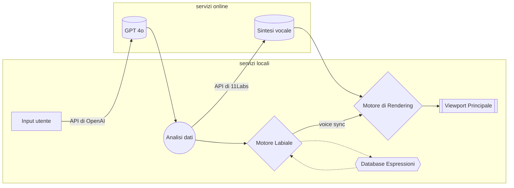

> [!WARNING]
> La documentazione di questo repository è scritta in INGLESE, e solo in un secondo momento trascritta nelle altre lingue! Per qualsiasi dubbio consultare anche la documentazione in inglese, poichè questa potrebbe non essere sempre aggiornata e coerente con le ultime modifiche apportate al repository, grazie.

# **I-Kant**®

- ⚠️ **I-Kant® è un progetto work in progress, ed è ancora nelle sue fasi iniziali di concezione e scrittura!** ⚠️

#### Supporto Multi Lingua

## Abstract

I-Kant® è un innovativo software dotato di un'interfaccia grafica (GUI) che integra reti neurali artificiali e tecnologie di animazione 3D, al fine di offrire un'esperienza immersiva di dialogo con i grandi filosofi della tradizione. Basato su un database di oltre 200 terabyte di informazioni grezze – una mole di dati equivalente a milioni di libri, miliardi di pagine web e innumerevoli archivi digitali – il sistema è in grado di generare simulazioni conversazionali coerenti, rispettando e riproducendo fedelmente il pensiero del filosofo selezionato.

L'interfaccia grafica presenta modelli 3D semi-realistici, progettati per riprodurre fedelmente i tratti somatici e le espressioni facciali dei filosofi. Questi modelli sono controllati in maniera dinamica ed in modo che il contenuto delle risposte e le relative espressioni visive risultino armonizzati, migliorando significativamente la qualità e l'immersività dell'interazione utente-sistema.

Il software è configurabile su diversi livelli di complessità, rendendosi così idoneo a un'ampia gamma di utilizzi: dall'introduzione ai grandi pensatori per studenti e appassionati, fino a uno strumento avanzato per gli studiosi e i ricercatori in ambito filosofico e umanistico.

> \* Gentilmente raccolti ed elaborati dai nostri amici di OpenAI

## Contents

I-Kant® utilizza una vastissima libreria di informazioni in modo da fornire all’utente una risposta più coerente ed esaustiva possibile. Alla base della comprensione linguistica delle domande poste dall’utente viene utilizzata una libreria scritta in Python che sfrutta le API (Application Programming Interface) della compagnia OpenAI, mentre per quanto riguarda la generazione vocale e altre funzionalità grafiche di gestione dei modelli 3d sono state utilizzate le API di ElevenLabs, Blender, PyOpenGL e molte altre.

## How does it work?

Qui puoi avere un diagramma di flusso logico sulla struttura del programma. L'applicazione è ancora nelle sue prime fasi di creazione e questo diagramma potrebbe cambiare nel tempo:

## Obiettivi

Lo scopo di I-Kant® è quello di strumento educativo, che possa avvicinare i più giovani alla filosofia attraverso strumenti moderni come l’intelligenza artificiale.

## Il nostro Workflow

Il progetto è impostato per garantire la massima interoperabilità tra sviluppatori, anche da remoto, attraverso il software “Git”, e le modifiche ed i progressi sono registrati su di esso per permettere un sistema di versioning avanzato.

## Strumenti e programmi utilizzati

Tutti gli strumenti che utilizziamo per lavorare a questo progetto hanno una politica OpenSource, in linea con i nostri principi e con la licenza MIT sotto cui si trova questo prodotto. A partire dagli IDE per scrivere il codice ai software gestionali, dalle librerie utilizzate fino ai programmi di modellazione 3D. Le uniche dipendenze proprietarie che questo progetto utilizza sono quelle di OpenAI, che nonostante le pressanti richieste da parte degli sviluppatori di tutto il mondo di rilasciare il codice sorgente ha deciso di adottare una politica closed source nei confronti dell’utenza finale.

## TODOs

- [x] Scrivere una buona documentazione (jk, ofc these docs will be improved😉)
- [ ] Scrivere il core GPT
- [ ] Integrazione con le librerie di ElevenLabs per la sintesi vocale
- [ ] 3D mapping dei modelli delle faccie
- [ ] Far funzionare il labiale in sync con le parole
- [ ] GUI
- [ ] Debugging

## Sitografia delle risorse utilizzate

- https://platform.openai.com/docs/concepts
- https://docs.python.org/3.13/
- https://neovim.io/doc/
- https://www.blender.org/
> This list will be updated in the future, stay tuned...

##### Progetto creato da Mamiliano Della Rosa & Emanuele Paradiso
