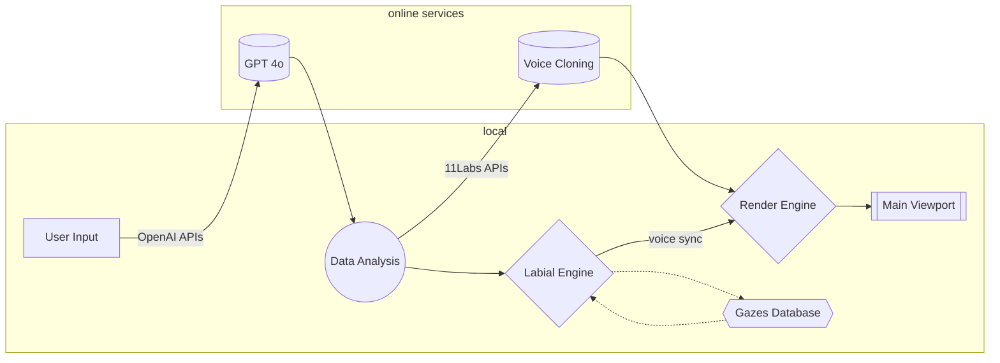

# **I-Kant**®

- ⚠️ **I-Kant is a w.i.p. project, and is still in its conception and coding phase!** ⚠️

#### Multi language support

[](https://github.com/LoSviluppatore/I-Kant/blob/main/README.md)
[](https://github.com/LoSviluppatore/I-Kant/blob/main/README.it.md)

## Abstract

I-Kant® is an innovative software equipped with a graphical interface (GUI) that integrates artificial neural networks and 3D animation technologies, in order to offer an immersive experience of dialogue with the great philosophers of tradition. Based on a database of over 200 terabytes of raw information\* - a mass of data equivalent to millions of books, billions of web pages and countless digital archives - the system is capable of generating coherent conversational simulations, respecting and faithfully reproducing the philosopher's thoughts selected.

The graphical interface features semi-realistic 3D models, designed to faithfully reproduce the physical features and facial expressions of philosophers. These models are controlled dynamically and so that the content of the responses and the related visual expressions are harmonized, significantly improving the quality and immersiveness of the user-system interaction.

The software can be configured on different levels of complexity, thus making it suitable for a wide range of uses: from an introduction to great thinkers for students and enthusiasts, up to an advanced tool for scholars and researchers in the philosophical and humanistic fields.

> \* Kindly collected and processed by our friends at OpenAI

## Contents

I-Kant® uses a vast library of information in order to provide the user with the most coherent and exhaustive answer possible. At the basis of the linguistic understanding of the questions posed by the user, a library written in Python is used which exploits the API (Application Programming Interface) of the OpenAI company, while as regards voice generation and other graphic functions for managing 3D models, the APIs of ElevenLabs, Blender, PyOpenGL and many others.

## How does it work?

Here you can have a logical flow chart on the structure of the program. The application is still in its early stages of creation and this diagram may change over time:



## Goals

The purpose of I-Kant® is that of an educational tool, which can bring younger people closer to philosophy through modern tools such as artificial intelligence.

## Our Workflow

The project is set up to guarantee maximum interoperability between developers, even remotely, through the "Git" software, and changes and progress are recorded on it to allow an advanced versioning system.

## Tools & Softwares We are using

All the tools we use to work on this project have an OpenSource policy, in line with our principles and with the MIT license under which this product is found. Starting from IDEs for writing code to management software, from the libraries used up to 3D modeling programs. The only proprietary dependencies that this project uses are those of OpenAI, which, despite pressing requests from developers all over the world to release the source code, has decided to adopt a closed source policy towards the end user.

## How to install and run I-Kant

#### [first make sure you have installed python](https://www.python.org/)

- [Download and extract the zip file from github](https://github.com/LoSviluppatore/I-Kant/archive/refs/heads/main.zip) or run:

```bash
git clone https://github.com/LoSviluppatore/I-Kant.git
```

- open the terminal and go to the project directory, then run:

```bash
pip install -r requirements.txt
```
> [!NOTE]
> this may take a bit...

- once the packages are installed run:

```bash
python .\scripts\main.py
```


## TODOs

- [x] Writing a good documentation (jk, ofc these docs will be improved😉)
- [ ] Coding the GPT core
- [ ] Integrations with ElevenLabs libraries for voice cloning
- [ ] 3D mapping of faces models
- [ ] Make the labial working and sync it with voice
- [ ] GUI
- [ ] Debugging

## References

- https://platform.openai.com/docs/concepts
- https://docs.python.org/3.13/
- https://neovim.io/doc/
- https://www.blender.org/
  > This list will be updated in the future, stay tuned...

##### Project created by Mamiliano Della Rosa & Emanuele Paradiso
